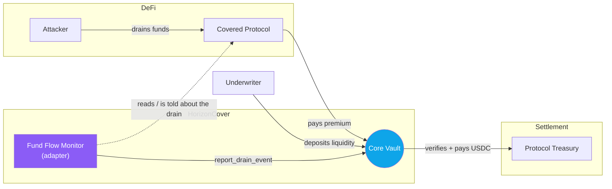

# HorizonCover

**Parametric insurance for DeFi protocols, built on Stellar.** When a covered protocol gets drained, the payout is decided by math and settled in USDC in seconds — no claims forms, no adjusters, no DAO vote.

[](LICENSE)
[](https://soroban.stellar.org)
[](https://horizon-cover-frontend.vercel.app/)

> Looking to contribute? We work issue-first — see [open issues](../../issues) and [CONTRIBUTING.md](CONTRIBUTING.md). Rust, TypeScript, and docs help are all welcome.

---

## The idea

On-chain insurance has a problem: the moment a protocol actually needs a payout is the moment it can least afford to wait. Traditional cover sits in review queues or governance votes for weeks, the assessment overhead makes small policies pointless, and underwriters lock up huge amounts of capital against fuzzy, discretionary risk.

HorizonCover takes the human judgment out of the *payout* decision. A policy defines, up front, a measurable trigger — "if more than 30% of declared TVL is drained, pay out proportionally to the severity." When that condition is reported and verified, the contract calculates the amount and transfers USDC. The math is fixed at registration, so there's nothing to argue about after the fact.

It won't cover everything insurance covers — parametric triggers are deliberately narrow and objective. That's the trade: less flexibility, but instant and trustless settlement for the cases it does cover.

---

## How it works

Two pieces, kept intentionally separate:

- **Core Vault** (`contracts/core`) — holds USDC, stores policies, and runs the payout math. It doesn't decide *when* an exploit happened; it only verifies a reported drain against a policy and pays. Underwriters fund it with `deposit_liquidity`, protocols keep coverage alive with `pay_premium`.
- **Fund Flow Monitor** (`contracts/adapters/fund-flow-monitor`) — the adapter that reports a drain to the vault. Protocols can pre-register normal withdrawals so a planned treasury move can't be mistaken for an exploit.

New trigger types (flash-loan patterns, oracle manipulation, bridge exploits) are added by writing new adapters, never by touching the vault.

### A note on "automatic" detection

Be aware of where the project actually is: **today the drain is reported by the monitor adapter, which is admin-gated in this MVP.** The vault independently verifies the report against the policy (threshold, premium currency, available capital) before paying, but the *detection* itself is not yet permissionless. Making the monitor read protocol balances directly on-chain so anyone can trigger it is the headline roadmap item — see [issue #1](../../issues/1).



---

## The payout math

Everything is integer-only and uses checked arithmetic — financial code here never touches floating point. A payout only happens once the drain crosses the policy's threshold, and it scales with how bad the drain was, capped at both the max benefit and whatever capital the vault actually holds:

```rust
let drain_bps = (amount_drained * 10_000) / total_locked_value;

if drain_bps > drain_threshold {
    let excess_bps = drain_bps - drain_threshold;
    let range_bps  = 10_000 - drain_threshold;
    let payout = (max_benefit * excess_bps) / range_bps;
    // ...then capped to max_benefit and to the vault's balance
}
```

So a policy with a 30% threshold pays nothing at a 25% drain, a partial amount at 50%, and the full benefit only at a total loss.

---

## Where the project is


**Working today:**
- Core Vault with policies, premiums, underwriter liquidity, and capped parametric payouts — covered by unit tests (`cargo test`).
- Fund Flow Monitor with the withdrawal whitelist wired in, so legitimate withdrawals can't trigger a payout.
- A TypeScript SDK that reads live contract state over Soroban RPC.
- A React dashboard with real wallet connection (Stellar Wallets Kit) and a payout simulator that runs the exact on-chain formula. It runs in **preview mode** with no deployment configured, so you can try it immediately.

**Not done yet** (and tracked as [issues](../../issues)):
- Permissionless on-chain drain detection (#1) — the big one.
- Underwriter withdrawals and a real solvency/reserve model (#2, #3).
- SDK write/transaction flows and the register-policy UI (#8, #10).
- A testnet deploy script so the dashboard shows live data (#15).

---

## Running it locally

**You'll need:** Rust (stable) with the `wasm32-unknown-unknown` target, the Stellar CLI, Node 20+, and pnpm.

```bash
git clone https://github.com/AtlasCrypt/HorizonCover.git
cd HorizonCover
pnpm install

# frontend — works straight away in preview mode
cd frontend
pnpm dev

# contracts
cd ../contracts
cargo test                  # run the test suite
pnpm build:contracts        # build deployable wasm (from repo root)
```

To point the frontend at a real deployment, copy `frontend/.env.example` to `frontend/.env.local` and fill in the contract IDs. Without them, the dashboard shows a clear "preview mode" state instead of fake numbers.

---

## Layout

This is a pnpm + Cargo monorepo. The frontend depends on the SDK, the SDK
depends on the shared types, and everything ultimately talks to the contracts.

```text
HorizonCover/
│
├── contracts/                          # Soroban smart contracts (Cargo workspace)
│   ├── core/
│   │   └── src/
│   │       ├── lib.rs                  # Core Vault: policies, premiums, liquidity, payouts
│   │       └── test.rs                 # vault unit tests
│   └── adapters/
│       ├── fund-flow-monitor/
│       │   └── src/
│       │       ├── lib.rs              # reports drains, holds the withdrawal whitelist
│       │       └── test.rs             # monitor unit tests
│       └── mock-protocol/
│           └── src/lib.rs              # a stand-in protocol for end-to-end testing
│
├── packages/                           # shared TypeScript workspace packages
│   ├── sdk/src/
│   │   ├── client.ts                   # HorizonClient — reads contract state over RPC
│   │   ├── calculator.ts               # off-chain payout math (mirrors the contract)
│   │   └── xdr-helpers.ts              # ScVal <-> native conversions
│   └── types/src/index.ts              # Policy, CoverageParams, PayoutPreview, ...
│
├── frontend/                           # React + Vite dashboard
│   ├── src/
│   │   ├── components/                 # Dashboard, ProtocolCard, PayoutSimulator, WalletButton
│   │   ├── hooks/                      # useWallet, useCoverage, useVault
│   │   ├── lib/                        # wallet kit + Horizon client wiring
│   │   └── config.ts                   # network + contract IDs from env
│   └── .env.example                    # copy to .env.local to target a deployment
│
├── docs/                               # ARCHITECTURE.md, SECURITY.md
└── .github/                            # issue templates, PR template, CI
```

---

## Docs

- [Architecture](./docs/ARCHITECTURE.md) — components, flows, payout sequence.
- [Security & threat model](./docs/SECURITY.md) — roles, assumptions, known limits.
- [Contributing](CONTRIBUTING.md) — setup, the issue-first workflow, and PR conventions.

---

## Contributing

We manage work through GitHub Issues, and they're assigned before work starts — so the first step is to comment on an unassigned issue rather than opening a surprise PR. Full details (branching, commit style, testnet setup) are in [CONTRIBUTING.md](CONTRIBUTING.md).

## License

MIT — see [LICENSE](LICENSE).
