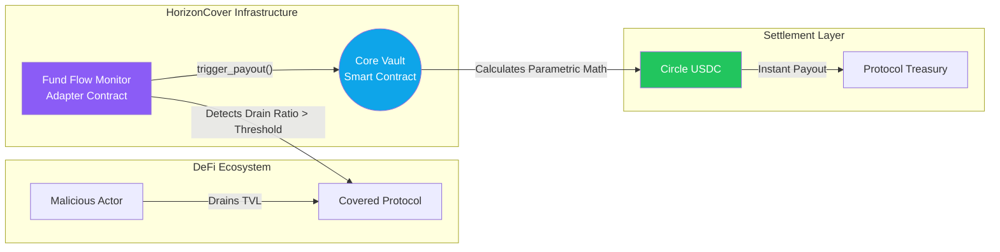

# HorizonCover

**A decentralized parametric DeFi insurance engine providing instant, math-enforced payouts on the Stellar network.**

[](LICENSE)
[](https://soroban.stellar.org)

> **Join the Build:** We are creating public-good DeFi infrastructure for the Stellar ecosystem. Whether you write Rust, TypeScript, or documentation, there is a place for you here. Check our [open issues](../../issues).

---

HorizonCover brings trustless, data-driven insurance to the blockchain. By monitoring on-chain fund flows through Soroban smart contracts, we eliminate the need for claims adjusters, turning months of bureaucratic waiting into a 3-second USDC settlement for exploited protocols.

### The DeFi Insurance Problem
Traditional smart contract insurance is fundamentally broken:

- **Prohibitive Overhead:** The administrative cost of assessing a hack using decentralized governance makes micro-policies unviable.
- **Subjective Delays:** Claims sit in DAO voting periods or human review queues for 30–90 days, leaving vulnerable protocols without critical liquidity when disaster strikes.
- **Capital Inefficiency:** Insurers must lock up immense capital to underwrite discretionary risks.

### The HorizonCover Architecture
We replace trust with code:

- **Soroban Core Vaults**: Secure pools holding USDC premiums, utilizing Protocol 26's checked arithmetic to guarantee absolute precision on every payout calculation.
- **Fund Flow Adapters**: Lightweight contracts that observe on-chain TVL (Total Value Locked). If a malicious drain occurs, they instantly trigger the core vault.
- **Monorepo Ecosystem**: A unified workspace featuring a React/Vite frontend, shared TypeScript types, and a robust developer SDK.

---

### Protocol Highlights
- ⚡ **Zero-Claim Execution**: Payouts are triggered automatically the moment an exploit threshold (e.g., >30% TVL drained) is met.
- 🔒 **Mathematical Guarantees**: Soroban's native math prevents any floating-point or rounding errors during financial distribution.
- 💸 **Instant Settlement**: Leverage Stellar's sub-5-second finality to distribute emergency liquidity exactly when the protocol needs it.
- 🛠️ **Plug-and-Play Adapters**: Developers can easily write new triggers for flash-loan attacks, oracle manipulation, or bridge exploits.

---

### System Flow


---

### The Parametric Formula
HorizonCover payouts are deterministic and proportional to the damage. If a protocol's drain ratio exceeds their policy threshold, the payout scales automatically:

```rust
let drain_ratio = (funds_drained * 10_000) / total_locked_value;

if drain_ratio > drain_threshold {
    let excess_bps = drain_ratio - drain_threshold;
    let range_bps = 10_000 - drain_threshold;
    
    // Proportional payout based on the severity of the hack
    let payout = (max_benefit * excess_bps) / range_bps;
}
```

---

### Current Status: Scaffolded for Stellar Wave ✅
We have successfully scaffolded the foundational monorepo and core mathematical models. We are now preparing to onboard contributors.

**Completed Foundations:**
- ✅ Monorepo architecture (pnpm) established.
- ✅ Core Vault contract written with deterministic payout math.
- ✅ Fund Flow Monitor and Mock Protocol adapters implemented.
- ✅ TypeScript SDK and Types packages built.
- ✅ React Frontend with dynamic payout sandboxes and Stellar Wallets Kit.

### 🛠️ Open Bounties & Tasks
Browse all contributor tasks on our [Issues board](../../issues). Filter by `wave-ready` to see what's available this wave.

---

### Local Development Quick Start

**Prerequisites:**
- Rust 1.74+ | `wasm32-unknown-unknown` target
- Node.js 20+ | pnpm 9+

**1. Clone & Install**
```bash
git clone https://github.com/AtlasCrypt/HorizonCover.git
cd HorizonCover
pnpm install
```

**2. Configure Environment**
```bash
# Add the WASM compilation target (one time only)
rustup target add wasm32-unknown-unknown
```

**3. Run the UI locally**
```bash
cd frontend
pnpm dev
```

**4. Compile Contracts**
```bash
pnpm build:contracts
```

---

### Project Structure
```text
HorizonCover/
├── contracts/               # Soroban Smart Contracts
│   ├── core/                # The main insurance vault & payout logic
│   └── adapters/            # Exploit detection triggers
├── frontend/                # React / Vite Dashboard
├── packages/                # Shared Libraries
│   ├── sdk/                 # TypeScript interaction SDK
│   └── types/               # Cross-repo TS definitions
└── docs/                    # Architecture and contributing guides
```

---

### Documentation
For deep dives into the protocol's inner workings and security model, please refer to:
- [**Architecture Guide**](./docs/ARCHITECTURE.md): System flows, component breakdown, and payout sequences.
- [**Security & Threat Model**](./docs/SECURITY.md): RBAC matrix, known limitations, and mitigation strategies.
- [**Contributing Guide**](CONTRIBUTING.md): Drips Wave guidelines and environment setup.

---

### Contributing to HorizonCover
HorizonCover is built for the community, by the community. 

To start contributing, browse the [Issues](../../issues) tab for tasks tagged with `good-first-issue` or `wave-task`. We maintain a collaborative, open environment—simply comment on an issue to claim it, fork the repository, and submit a PR.

For detailed guidelines, see our [Contributing Guide](CONTRIBUTING.md).

---

### License
This project is licensed under the MIT License - see the [LICENSE](LICENSE) file for details.

---

### Acknowledgements
This protocol is a proud participant in the **Stellar Drips Wave** and the broader open-source Soroban ecosystem. By combining parametric triggers with the raw speed of Stellar, we are providing the safety net that DeFi desperately needs.
