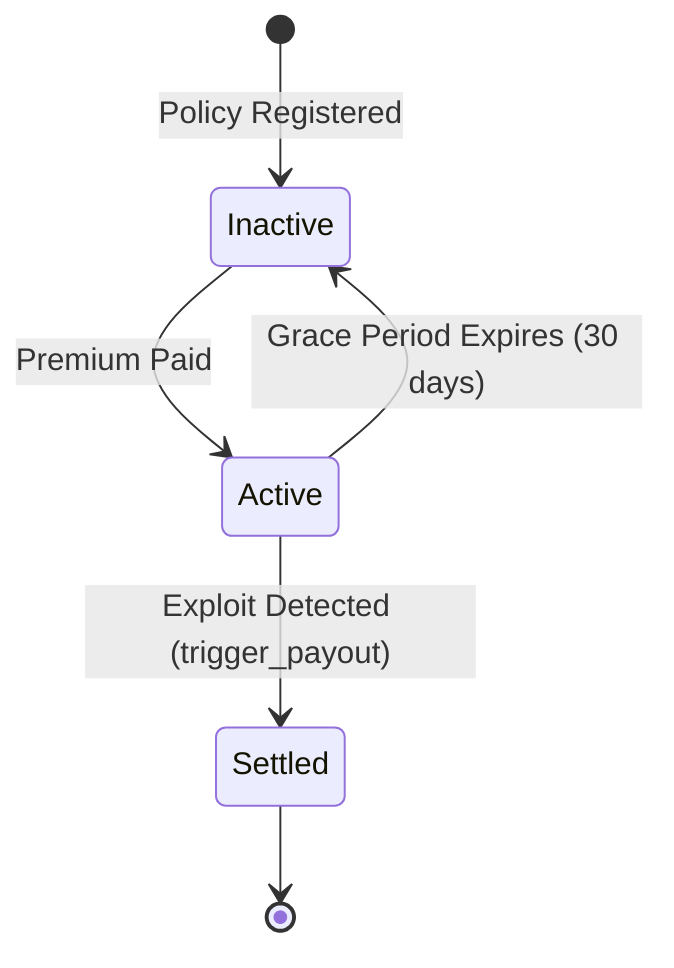

# Architecture

HorizonCover is a parametric DeFi insurance protocol built natively on Soroban (Stellar's smart contract platform). It operates entirely on-chain without human claims adjusters, using a data-driven approach to detect exploit events and trigger automatic payouts.

## High-Level System Design

The architecture is divided into three primary layers:
1. **The Core Vault:** Holds the USDC premiums, manages the registry of covered protocols, and holds the logic for the payout formula.
2. **The Adapters:** Specialized contracts (like the Fund Flow Monitor) that observe on-chain events and interact with the Core Vault via cross-contract calls.
3. **The Off-Chain Environment:** A TypeScript SDK and React Frontend that allow users to simulate payouts and allow protocols to register for coverage.

```mermaid
graph TD
    subgraph Frontend & SDK
        A[React Dashboard] -->|uses| B(@horizoncover/sdk)
        B -->|RPC calls| C[Stellar Network]
    end

    subgraph Soroban Network
        C --> D[Core Vault Contract]
        E[Fund Flow Monitor Adapter] -->|trigger_payout| D
        F[Mock Protocol / Covered DeFi App] -->|pay_premium| D
        E -.->|observes| F
    end

    subgraph Users
        G[Beneficiary] <--|Receives Payout| D
        H[Protocol Admin] -->|Registers| D
    end
```

## Component Breakdown

### Core Vault (`contracts/core`)
The brain of the system. It maintains the state of all `Policy` objects in persistent storage.
- **DataKey::Policy**: Maps a covered protocol address to its specific insurance policy.
- **payout formula**: A mathematically deterministic basis point calculation. If a protocol declares \$1M TVL and is drained for \$400k (40%), and the threshold is 30%, the protocol receives a proportional payout based on the 10% excess.

### Fund Flow Monitor (`contracts/adapters/fund-flow-monitor`)
In the MVP, this acts as the "Oracle" that detects an exploit. Rather than relying on off-chain data sources, it monitors on-chain balances directly.
- If an anomalous transaction (a hack) drains funds beyond the threshold, it triggers the vault.
- It includes a whitelist mechanism `register_normal_withdrawal` so protocols can conduct large legitimate migrations without triggering a false positive payout.

### Mock Protocol (`contracts/adapters/mock-protocol`)
A testing fixture for the Stellar Wave program. It simulates a standard DeFi application with `deposit` and `withdraw` methods, but also includes a `drain` function to simulate an exploit for integration testing.

## State Transitions (Policy Lifecycle)



## Payout Execution Sequence

1. Covered protocol pays premium → `Core Vault` updates `last_premium_paid`
2. Exploit occurs → protocol TVL drops
3. Admin (MVP) calls `report_drain_event(protocol, amount_drained)` on Monitor
4. Monitor checks `is_whitelisted_withdrawal` → not whitelisted
5. Monitor calls `trigger_payout(protocol, amount_drained)` on Core Vault
6. Core Vault checks: policy active? premium current? not settled?
7. Core Vault runs payout formula → calculates USDC amount
8. Core Vault transfers USDC to beneficiary address
9. Core Vault sets `is_settled = true`
